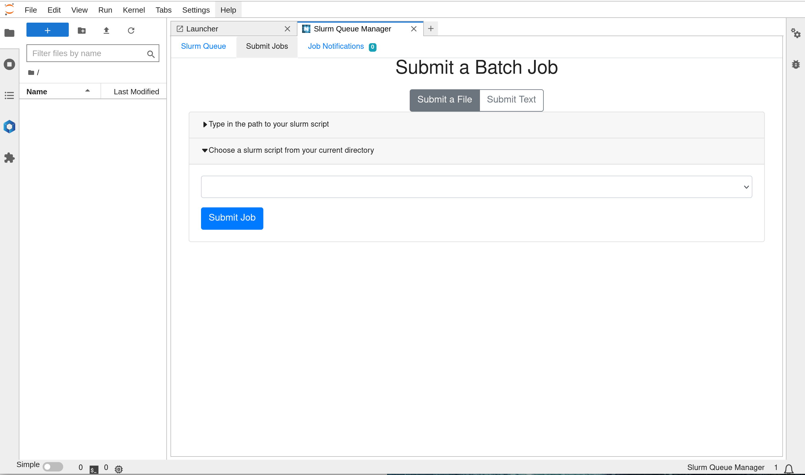
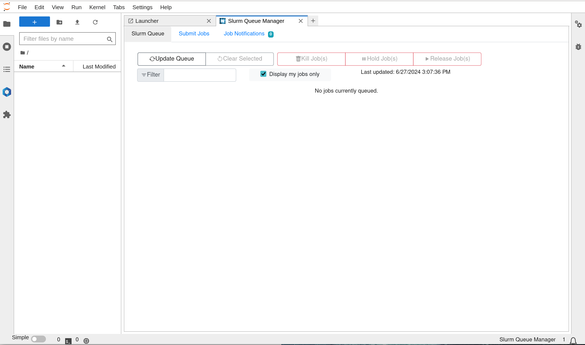
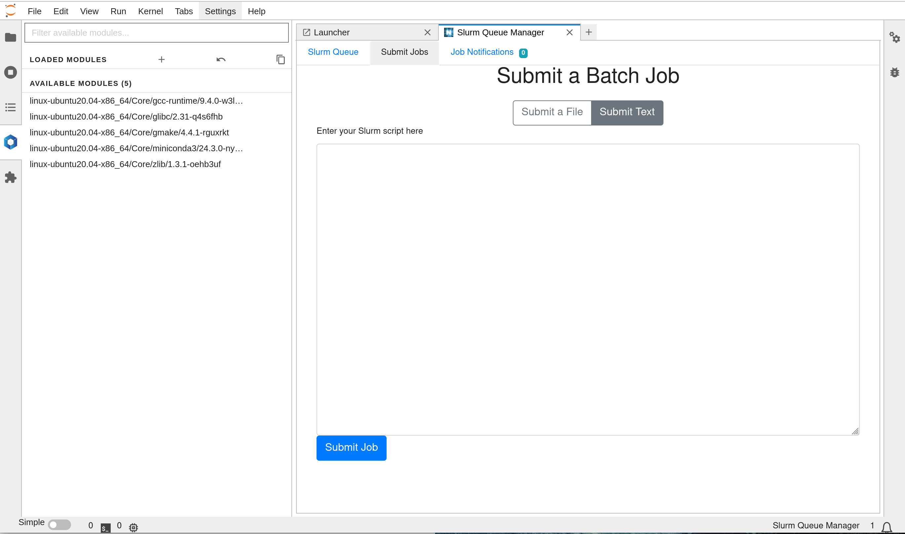

# single-node-slurm-cluster-docker (Ubuntu)

Fully Dockerized Slurm cluster with CPU/GPU partition and Jupyterlab HPC extensions for local PC or Server deployment using docker compose and more.
<div align="center">
</div>

It consist of the following services:
- MariaDB node (for storage of accounting data)
- phpmyadmin node ( for web sql client)
- Jupyterlab node (notebook, slurm client)
- Storage node (munge, slurmdbd)
- Master node (munge, slurmctld-controller)
- compute GPU nodes x1 (munge, slurmd, nvidia-gpu)
- compute CPU nodes x2 (munge, slurmd)

Optional:
- NFS Server node (for shared storage )

The slurm version is `v19.05.5`

```
admin@slurmmaster:~$ sinfo
PARTITION AVAIL  TIMELIMIT  NODES  STATE NODELIST
slurmgpu     up   infinite      1   idle slurmnode[1]
slurmcpu*    up   infinite      2   idle slurmnode[2,3]
```

<br />

## Pre-requisites 
1. Supported OS (tested on ubuntu 20.04+, should work on other platform with docker/nvidia-container-toolkit support)

2. Host PC/VM with docker installed
```
curl -fsSL https://get.docker.com -o get-docker.sh 
sh get-docker.sh
```
3. Nvidia-Container-Toolkit
```
curl -fsSL https://nvidia.github.io/libnvidia-container/gpgkey | sudo gpg --dearmor -o /usr/share/keyrings/nvidia-container-toolkit-keyring.gpg \
  && curl -s -L https://nvidia.github.io/libnvidia-container/stable/deb/nvidia-container-toolkit.list | \
    sed 's#deb https://#deb [signed-by=/usr/share/keyrings/nvidia-container-toolkit-keyring.gpg] https://#g' | \
    sudo tee /etc/apt/sources.list.d/nvidia-container-toolkit.list

sudo apt update

sudo apt-get install -y nvidia-container-toolkit

sudo nvidia-ctk runtime configure --runtime=docker

cat /etc/docker/daemon.json

sudo systemctl restart docker
```
## Status
On-going developments and improvement works

## Related Projects

#### multi-node slurm cluster docker
https://github.com/minyang-chen/multi-nodes-slurm-cluster-docker/tree/main

#### slurm job samples
https://github.com/minyang-chen/slurm-job-samples
<br />

## How to deploy

Clone the repository

```
hostpc$ git clone https://github.com/minyang-chen/single-node-slurm-cluster-docker.git
hostpc$ cd single-node-slurm-cluster-docker
```

Next, build the node image.
```
hostpc$ ./build_images.sh
```

Start the cluster

```
hostpc$ ./1_create_slurm_cluster.sh
```

To access the storage node:

```
hostpc$ docker compose exec -it slurmdbd bash
```

register the cluster:
```
slumdbd$ /usr/bin/sacctmgr add cluster name=clusterlab 

expected confirmation message (Y/N) enter Y
next check cluster registration status with accounting manager command

slumdbd$ sacctmgr 

```
next, restart master and storage node:
```
hostpc$ docker compose restart slurmdbd slurmmaster
```

## Manage the Cluster

Check cluster status in jupyterlab:
http://localhost:8888 default password (password)

note: change hashed password on jupyter/docker-entrypoint.sh

or check cluster status in any other cluster node:
```
hostpc$ docker compose exec -it slurmdbd bash
```
```
admin@slurmmaster:~$ sinfo
PARTITION AVAIL  TIMELIMIT  NODES  STATE NODELIST
slurmgpu     up   infinite      1   idle slurmnode[1]
slurmcpu*    up   infinite      2   idle slurmnode[2,3]
```

To start the cluster in daemon mode:

     $ docker-compose up -d


To restart the cluster:

     $ docker-compose restart

To stop it:

     $ docker-compose stop

To check logs:

     $ docker-compose logs

     (stop logs with CTRL-c")

To check running containers:

     $ docker-compose ps


To Add more nodes on the cluster, update docker compose section:
```
  slurmnodeX:
    image: slurm-node:latest
    hostname: slurmnodeX
    user: admin
    volumes:
      - ./workspace:/home/admin
      - ./etc/slurm-llnl/cgroup.conf:/etc/slurm-llnl/cgroup.conf            
      - ./etc/slurm-llnl/gres.conf:/etc/slurm-llnl/gres.conf            
      - ./etc/slurm-llnl/slurm.conf:/etc/slurm-llnl/slurm.conf            
      - ./etc/slurm-llnl/slurmdbd.conf:/etc/slurm-llnl/slurmdbd.conf                 
      - ./node/docker-entrypoint.sh:/etc/slurm-llnl/docker-entrypoint.sh                                
      - /sys/fs/cgroup:/sys/fs/cgroup:ro                        
    links:
      - slurmmaster      
```

NOTE: the first running of Slurm might take up to 1-3 minute because a new MariaDB database initiation procedure and slurm master restart to pick up all nodes joining the cluster.

## Update Cluster Configuration 

#### etc/slurm-llnl/slurm.conf
this is the main cluster configuration file 

#### etc/slurm-llnl/gres.conf
this is the nodes GPU configuration file 

#### etc/slurm-llnl/slurmdbd.conf
this is the cluster accounting configuration file 

#### etc/slurm-llnl/slurm.no_tres
this is the main cluster configuration file without tres enablement 


## Using Jupyterlab Slurm Extensions

#### HPC-Tools (jupyterl_slurm)
GUI extension that support management of slurm jobs submission and status monitoring 
see screenshots here:




#### Module Softwares (jupyterlmod)
GUI extension that support viewing of available and installed modules in the cluster
see screenshot here:


#### Enabling Virtualization and GPU Passthrough
On many machines, virtualization and GPU passthrough are not enabled by default. Follow these directions so that a virtual DeepOps cluster can start on your host machine with GPU access on the VMs.

**BIOS and Bootloader Changes**
To support KVM, we need GPU pass through. To enable GPU pass through, we need to enable VFIO support in BIOS and Bootloader.

**BIOS Changes**
Enable BIOS settings: Intel VT-d and Intel VT-x
Enable BIOS support for large-BAR1 GPUs: 'MMIO above 4G' or 'Above 4G encoding', etc.
VT-x: Intel RC Setup -> Processor Configuration -> VMX
VT-d: Intel RC Setup -> IIO Configuration -> VT-d
MMIO above 4G: Advanced -> PCI Subsystem Setting -> Above 4G Encoding
MMIO above 4G: verify virtualization support is enabled in the BIOS, by looking for vmx for Intel or svm for AMD processors...
$ grep -oE 'svm|vmx' /proc/cpuinfo | uniq
vmx

**Bootloader Changes**
Add components necessary to load VFIO (Virtual Function I/O). VFIO is required to pass full devices through to a virtual machine, so that Ubuntu loads everything it needs. Edit and add the following to /etc/modules file:
- pci_stub
- vfio
- vfio_iommu_type1
- vfio_pci
- kvm
- kvm_intel
Next, need Ubuntu to load IOMMU properly. Edit /etc/default/grub and modify "GRUB_CMDLINE_LINUX_DEFAULT", by adding "intel_iommu=on" to enable IOMMU. May also need to add "vfio_iommu_type1.allow_unsafe_interrupts=1" if interrupt remapping should be enabled. Post these changes, the GRUB command line should look like this:
GRUB_CMDLINE_LINUX_DEFAULT="quiet splash intel_iommu=on vfio_iommu_type1.allow_unsafe_interrupts=1
iommu=pt"

**Enable the vfio-pci driver on boot:**
$ echo vfio-pci | sudo tee /etc/modules-load.d/vfio-pci.conf
```
Run sudo update-grub to update GRUB with the new settings and reboot the system.
```

#### Contribution, Bugs fixes and Support
Welcome, please create an issue.

#### Acknowledgements
Inspired by works from other Linux Distribution 
rockylinux: [slurm-docker-cluster](https://github.com/giovtorres/slurm-docker-cluster)
CentOS: [slurm-in-docker](https://github.com/SciDAS/slurm-in-docker)


